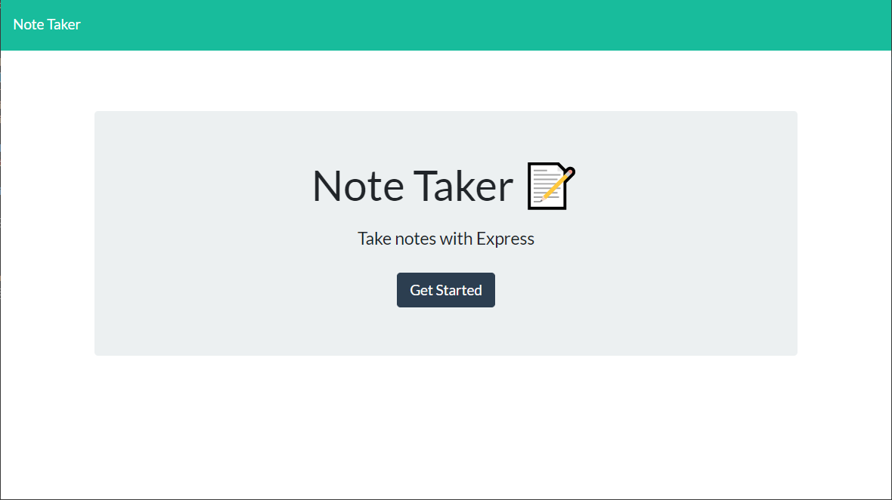
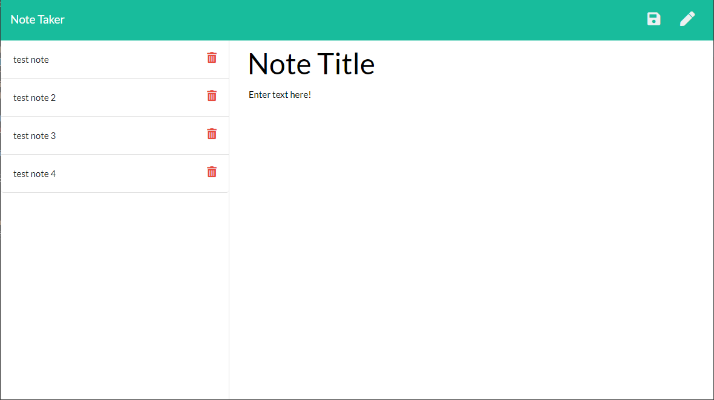

# Express Note Taker

## Description: 
The Express Note Taker allows the user to write, save, and delete notes.  It uses an express backend to save and retrieve notes. 

## Installation: 
`npm i` to install required nodes

## Questions:
* GitHub Profile:  [the-medium-place](https://github.com/the-medium-place)
* Email: <zgstowell@gmail.com>

